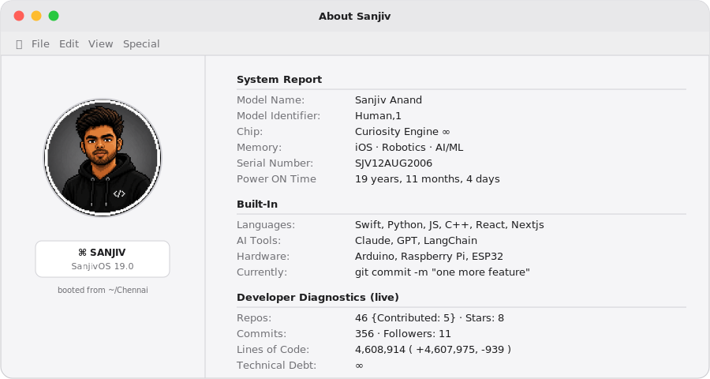

<picture>
  <source media="(prefers-color-scheme: dark)" srcset="assets/dark_mode.svg">
  <source media="(prefers-color-scheme: light)" srcset="assets/light_mode.svg">
  
</picture>

 
Auto-updates daily via GitHub Actions &middot; switches with your system's light/dark mode

